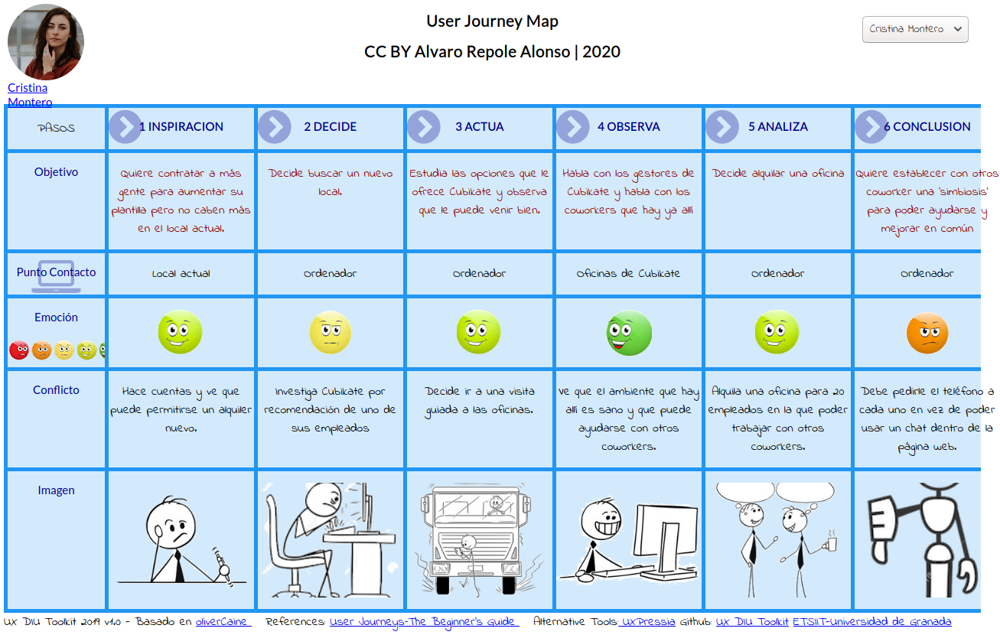

# DIU20
Prácticas Diseño Interfaces de Usuario 2019-20 (Coworking) 

Grupo: DIU 3ºB.  Curso: 2019/20 

Proyecto: 
Cubikate

Descripción: 

Estudio y analisis de Cubikate, que es una aplicación de coworking para poder alquilar locales para pequeñas empresas, autónomos o emprendedores. 

Logotipo: 
>>> Opcionalmente si diseña un logotipo para su producto en la práctica 3 pongalo aqui

Miembros
 * :bust_in_silhouette:   Alvaro Repole Alonso     :https://github.com/Alrealos:     

----- 

# Proceso de Diseño 

## Paso 1. UX Desk Research & Analisis 

 1.a Competitive Analysis
-----

Antes de empezar el propio análisis de Cubikate, vamos a ver qué otras opciones hay en el mercado para así poder compararb y sacar a la luz las virtudes y los defectos de la aplicación. Una de las opciones que tenemos es ErrantT. Lo que podemos ver a primera vista es que ErrantT tiene una interfaz más simple y menos funcional. En cuanto a nivel funcional, ambos presentan una estructura similar: cabeceras con menús con opciones, cuerpo en el que explican el motivo de la aplicación, enlaces a redes sociales, mapa con la ubicación del sitio. 
Ambos sitios web son bastante parecidos, pero Cubikate tiene más presencia visual y es más intuitivo, teniendo más elementos en la pagina principal y estando más ordenado. Además, Cubikate tiene una parte del cuerpo del sitio web con mensajes que han puesto los usuarios de la página, dando una buena primera impresión y una sensación de comunidad dentro de la aplicación.
En definitiva, Cubikate parece un proyecto más trabajado a primera vista y que es capaz de atraer la atención del público, pero gracias a este análisis podremos ver sus puntos débiles y ayudar a mejorarlo.

 1.b Persona
-----
Nuestra primera persona es Antonio Gutierrez, un autonomo que quiere dar un giro a su negocio de informática alquilando un local nuevo. Es un ejemplo clásico de un empresario o autonomo que quiere alquilar una oficina en Cubikate para su negocio.
 

La segunda persona es Cristina Montero, una chica emprendedora que decidió crear un periodico antibulos pero que su local se le ha quedado pequeño debido al crecimiento que ha tenido su diario. Este tipo de persona exigente puede sacar a relucir carencias de la página y nos puede servir para añadir nueva funcionalidades o corregir los existentes.
 

 1.c User Journey Map
----
Antonio Gutierrez quiere dar un giro a su negocio que se empieza a estancar por lo que decide cambiar de local. Descubre lo que es el coworking y se pone en contacto con Cubikate para alquilar una oficina. Tras hablarlo con su equipo, decide alquilar una oficina en la que poder negociar con proveedores y aliviar trabajo en el taller, pero echa en falta algunas cosas en la página:
 

Cristina al ver el 'boom' que ha supuesto su periodico se ve en la obligación de contratar a más empleados para dar covertura a la demanda que tiene ya el periodico, por lo que busca nuevas opciones. Decide meterse en Cubikate para ver que le pueden ofrecer y tras ver el ambiente y las opciones alquila una oficina para poder trabajar con otros coworkers y poder usar sus recursos y conocimiento para mejorar su empresa, pero la falta de un foro o un chat para poder hablar con otros coworkers dificulta su idea:
 

 1.d Usability Review
----

Valoración Final: 80*

El Usability Review que hemos hecho nos muestra que el sitio web se caracteriza por la simpleza, por ofrecer información concisa y una estructura que no da lugar a malinterpretaciones. Si lo enfocamos desde una perspectiva de mejora, deberíamos poner los N/A de UX en Very poor en cuanto a las funcionalidades de las que carece la página. Esto bajaría la nota a 70 (comprobado), por lo que tendríamos muchos ámbitos en los que poder mejorar la experiencia de usuario. En definitiva una aplicación con margen de mejora pero que ofrece lo necesario para que la página sea utilizable.

## Paso 2. UX Design  

 2.a Feedback Capture Grid
----

  
  
Cubikate posee una pagina elegante y sencilla que ofrece con solvencia información acerca del coworking y sus instalaciones. Pero esa sencillez de puede percibir como algo negativo ya que se podría mejorar mucho la presencia de la página añadiendo una serie de funcionalidades que ayude a los usuarios que la visiten. Primero, se podría añadir un sistema de gestión  de usuarios para que los visitantes tengan su espacio propio y personalizable, con calendarios e itinerarios para los que tengan una oficina alquilada. También se podría ampliar la información y modularizarla gracias a un buscador que facilite el encontrarla. Además, dado que no todos los coworkers estarán en la oficina a la vez, se puede habilitar un espacio en el que puedan charlar o dejar opiniones o lo que consideren para que sus compañeros lo vean y se forme un pequeña comunidad para mejorar las relaciones entre estos.
En definitiva con unas cuantas nuevas funcionalidades podemos darle otro toque y mejorar notablemente la experiencia de usuario.

 2.b Tasks & Sitemap 
-----

>>> Definir "User Map" y "Task Flow" ... 

 2.c Labelling 
----

>>> Identificar términos para diálogo con usuario  

Término | Significado     
| ------------- | -------
  Login¿?  | acceder a plataforma

 2.d Wireframes
-----

>>> Plantear el  diseño del layout para Web/movil (organización y simulación ) 

## Paso 3. Mi equipo UX-Case Study 

 3.a ¿Como se cuenta un UX-Case Study?
-----

>>> Analizar lo aprendido de la experiencia MuseApp 

  3.b Logotipo
----

>>> Si diseña un logotipo, explique la herramienta utilizada y la resolución empleada. ¿Puede usar esta imagen como cabecera de Twitter, por ejemplo, o necesita otra?

 3.c Guidelines
----

>>> Tras documentarse, muestre las deciones tomadas sobre Patrones IU a usar para la fase siguiente de prototipado. 

  3.d Video
----

>>> Documente y resuma el diseño de su producto en forma de video de 90 segundos aprox

## Paso 4. Evaluación 

 4.a Casos asignados
----

>>> Descripción de las asignaciones (3 UX Case Study) y enlace a  sus repositorios.

>>>> En la seccioón P4/readme.md se debe acceder además a sus respectivas hojas de evaluación y conclusiones 

 4.b User Testing
----

>>> Seleccione a una de sus personas ficticias. Exprese las ideas de posibles situaciones conflictivas de esa persona en las propuestas evaluadas

. 4.c Ranking 
----

>>> Concluya con un ranking de los casos evaluados 

>>> Valoración personal 

## Paso 5. Evaluación de Accesibilidad  

  5.a Accesibility evaluation Report
----

>>> Indica qué pretendes evaluar (de accesibilidad) y qué resultados has obtenido + Valoración personal

>>> Evaluación de la Accesibilidad (con simuladores o verificación de WACG) 

## Conclusión final / Valoración de las prácticas

>>> (90-150 palabras) Opinión del proceso de desarrollo de diseño siguiendo metodología UX y valoración (positiva /negativa) de los resultados obtenidos  

