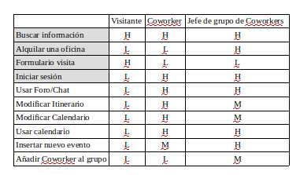

# DIU20 Trabajo Final
Diseño Interfaces de Usuario (Coworking) 

Grupo: DIU 3ºB.  Curso: 2019/20 

Proyecto: 
Cubikate

Descripción: 

Estudio y analisis de Cubikate, que es una aplicación de coworking para poder alquilar locales para pequeñas empresas, autónomos o emprendedores. 

Realizado por:
 * :bust_in_silhouette:   Alvaro Repole Alonso - (77203230G)   

----- 

# Proceso de Diseño 

## UX Desk Research & Analisis 

 Competitive Analysis
-----

Antes de empezar el propio análisis de Cubikate, vamos a ver qué otras opciones hay en el mercado para así poder compararb y sacar a la luz las virtudes y los defectos de la aplicación. Una de las opciones que tenemos es ErrantT. Lo que podemos ver a primera vista es que ErrantT tiene una interfaz más simple y menos funcional. En cuanto a nivel funcional, ambos presentan una estructura similar: cabeceras con menús con opciones, cuerpo en el que explican el motivo de la aplicación, enlaces a redes sociales, mapa con la ubicación del sitio. 
Ambos sitios web son bastante parecidos, pero Cubikate tiene más presencia visual y es más intuitivo, teniendo más elementos en la pagina principal y estando más ordenado. Además, Cubikate tiene una parte del cuerpo del sitio web con mensajes que han puesto los usuarios de la página, dando una buena primera impresión y una sensación de comunidad dentro de la aplicación.
En definitiva, Cubikate parece un proyecto más trabajado a primera vista y que es capaz de atraer la atención del público, pero gracias a este análisis podremos ver sus puntos débiles y ayudar a mejorarlo.

 Persona
-----
Nuestra primera persona es Antonio Gutierrez, un autonomo que quiere dar un giro a su negocio de informática alquilando un local nuevo. Es un ejemplo clásico de un empresario o autonomo que quiere alquilar una oficina en Cubikate para su negocio.
 

La segunda persona es Cristina Montero, una chica emprendedora que decidió crear un periodico antibulos pero que su local se le ha quedado pequeño debido al crecimiento que ha tenido su diario. Este tipo de persona exigente puede sacar a relucir carencias de la página y nos puede servir para añadir nueva funcionalidades o corregir los existentes.
 

 User Journey Map
----
Antonio Gutierrez quiere dar un giro a su negocio que se empieza a estancar por lo que decide cambiar de local. Descubre lo que es el coworking y se pone en contacto con Cubikate para alquilar una oficina. Tras hablarlo con su equipo, decide alquilar una oficina en la que poder negociar con proveedores y aliviar trabajo en el taller, pero echa en falta algunas cosas en la página:
 

Cristina al ver el 'boom' que ha supuesto su periodico se ve en la obligación de contratar a más empleados para dar covertura a la demanda que tiene ya el periodico, por lo que busca nuevas opciones. Decide meterse en Cubikate para ver que le pueden ofrecer y tras ver el ambiente y las opciones alquila una oficina para poder trabajar con otros coworkers y poder usar sus recursos y conocimiento para mejorar su empresa, pero la falta de un foro o un chat para poder hablar con otros coworkers dificulta su idea:
 

 Usability Review
----

Valoración Final: 80*

El Usability Review que hemos hecho nos muestra que el sitio web se caracteriza por la simpleza, por ofrecer información concisa y una estructura que no da lugar a malinterpretaciones. Si lo enfocamos desde una perspectiva de mejora, deberíamos poner los N/A de UX en Very poor en cuanto a las funcionalidades de las que carece la página. Esto bajaría la nota a 70 (comprobado), por lo que tendríamos muchos ámbitos en los que poder mejorar la experiencia de usuario. En definitiva una aplicación con margen de mejora pero que ofrece lo necesario para que la página sea utilizable.

##  UX Design  

 Feedback Capture Grid
----

  
  
Cubikate posee una pagina elegante y sencilla que ofrece con solvencia información acerca del coworking y sus instalaciones. Pero esa sencillez de puede percibir como algo negativo ya que se podría mejorar mucho la presencia de la página añadiendo una serie de funcionalidades que ayude a los usuarios que la visiten. Primero, se podría añadir un sistema de gestión  de usuarios para que los visitantes tengan su espacio propio y personalizable, con calendarios e itinerarios para los que tengan una oficina alquilada. También se podría ampliar la información y modularizarla gracias a un buscador que facilite el encontrarla. Además, dado que no todos los coworkers estarán en la oficina a la vez, se puede habilitar un espacio en el que puedan charlar o dejar opiniones o lo que consideren para que sus compañeros lo vean y se forme un pequeña comunidad para mejorar las relaciones entre estos.
En definitiva con unas cuantas nuevas funcionalidades podemos darle otro toque y mejorar notablemente la experiencia de usuario.

 Tasks & Sitemap 
-----
Primero realizamos una matriz de tareas/usuarios para ver qué tareas son más importantes y para qué usuarios. Diferenciamos 3 tipos de usuarios: Visitantes, que tienen una navegabilidad parecida a la actualmente tenemos ahora, Jefes de los grupos/arrendadatarios, que organizan su espacio online y tienen capacidad de añadir o quitar coworkers del grupo, y los propios coworkers, que usan la página de una manera más fluida, haciendo uso del calendario y del itinerario, foro, etc...

Realizamos el site-map, donde seguimos teniendo una estructura sencilla y clara, con apartado bien diferenciados:

 Labelling 
----

Definimos unos términos para mejorar la interacción entre el usuario y la página:

Término | Significado     
| ------------- | -------
  Coworking | Espacio de cooperacion de trabajadores indepenpendientes
  Coworkers | Personas que trabajan en un espacio de coworking
  Arrendatario | Persona que alquila un local o una oficina
  Reservar Oficina | Alquiler de un espacio en las instalaciones de Cubikate
  Mi cuenta | Perfil del usuario registrado
  Oficina Virtual | Espacio privado de un grupo que tiene una oficina alquilada.
  Itinerario | Planning de la oficina
  Calendario | Plan mensual de eventos en una oficina
  Foro | Chat en el que los coworkers pueden interacturar.

 Wireframes
-----
Realizaremos unos templates para ver como quedaría la página resultante. Los bocetos al ser en blanco y negro no se muestran los colores, pero sigue en la misma linea de la pagina actual de Cubikate, con un diseño simple y elegante:

-Pagina Principal: La página principal seguira teniendo un diseño muy parecido pero con algunos cambios en el menú, añadiendo opciones y una barra para buscar más facilmente por la página.
El boton de ayuda sigue estando en la parte inferior izquierda y si seguimos bajando todo sigue igual.

-Login: A esta pagina llegaremos si no estamos registrados en la pagina y pulsamos en alguna de las opciones Mi cuenta, Foro y Oficina Virtual.

Mi cuenta: En este apartado tenemos una foto con el perfil del coworker, con un espacio reservado para añadir sus gadgets y organizar su espacio propio. Si vemos la cuenta de otro coworker, veriamos lo mismo pero sin las ocpiones de modificar cuenta, datos o espacio propio.

-Oficina Virtual: Posiblemente la funcionalidad nueva más importante, donde los coworker pueden ver el calendario y el itinerario de su grupo/empresa en las oficinas de Cubikate. Además, hay un mini chat donde pueden dejar mensajes para que los vean los otros compañeros. El Jefe/lider tendría una pestaña donde podría añadir o quitar permisos de visualización-escritura a sus empleados.

-Foro: En el foro los coworkers de todos los grupos podrán conversar y dejar opiniones, charlas, dudas, aclaraciones, quedadas, etc... Estarían dividido en subforos con diferentes tematicas y los mensajes estarían diferenciados por el nombre y el grupo/empresa al que pertenece el coworker.

 Guidelines
----

Tras ver el buen funcionamieno general del reescalado de la página(solo falla una imagen al reescalarse), dejeremos el patrón de diseño que está implementado, que es el de Mostly Fluid. En este patrón en las resoluciones medianas los contenidos de la página de ajustar a los margenes horizontales. Para resoluciones máximas el contenido quedaría en el centro de la página con unos margenes muy grandes. En el caso de resoluciones pequeñas, la cuadricula fluida genera el contenido principal y el resto de columnas se agrupan verticalmente debajo.
Así quedarían las distintas resoluciones:

Gracias a este patrón el sitio web se adapa tanto a las resoluciones de tablets, móviles y ordenadores con versatilidad. Además es muy fácil de implementar ya que solo se necesita un punto de ruptura en el código de la página.

En cuanto al diseño de la página, se optaría por el mismo patrón de colores, ya que gracia a la extensión de google Accessibility Insights for Web hemos podido comprobar que de acuerdo a las pautas WCAG 2 el contraste es correcto. De hecho, el único problema de la página está en el formulario como bien dijimos antes, ya que no hay suficiente contraste entre las letras predeterminadas y el fondo del mismo formulario. Este mismo diseño se aplicaría a las nuevas funcionalidades manteniendo la fuente de letra, la cual es legible y correcta, manteniendo el tono azul con el contraste en blanco.
Por último, podríamos añadir la opción de activar el modo oscuro, por lo que deberiamos adaptar el estilo para esta opción.

# Conclusión:
Hemos adaptado un página web que era buena en lineas generales pero con pocas funcionalidades y le hemos añadido unas cuantas opciones que mejoraran la experiencia de usuario teniendo un espacio personal, atraerá más usuarios y fomentará las relaciones entre los mismos. En definitva, le hemos dado más opciones manteniendo el estilo elegante y simple que caracterizaba a la página y que queremos transmitir a nuestros clientes.
